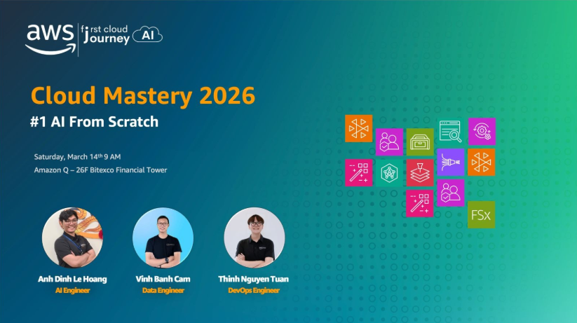

# Summary Report: “Cloud Mastery Series #1: AI From Scratch”

### Event Information

- **Event Name:** Cloud Mastery Series #1: Exploring Generative AI  
- **Date & Time:** 09:00 – 12:00, March 14, 2026  
- **Location:** 26th Floor, Bitexco Financial Tower, 02 Hai Trieu Street, District 1, Ho Chi Minh City  
- **Role:** Attendee  

### Description

This workshop was designed for the student community and focused on the practical applications of Generative AI (GenAI). The session included integrating AI models into real-world applications and optimizing the software development process.

### Event Objectives

- Explore practical applications of Generative AI (GenAI) in project development.
- Introduce the art of communicating with AI through advanced Prompt Engineering.
- Guide the development of autonomous AI Agents and tool integration (Tool Use).
- Demonstrate AI and IoT (AIoT) combination projects applied in real life.

### Speakers

- Mr. Dinh Le Hoang (Aiden Dinh) – AI Engineer.  
- Mr. Vinh Banh Cam – Data Engineer.  
- Mr. Thinh Nguyen Tuan – DevOps Engineer.  

### Highlights

#### Advanced Prompt Engineering Techniques

- Identifying issues with poor prompts: token waste, inconsistent results, and decreased productivity.
- Components of a professional Prompt: Role, Instruction, Context, Input, Output, Few-shot Examples, and Constraints.
- Optimization techniques: Chain-of-Thought (CoT), Self-Consistency, Tree-of-Thoughts (ToT), and RAG.

#### Building AI Agents with Strands

- Overcoming limitations of traditional LLMs by connecting to the real world via tools (APIs, Database).
- Operational workflow of Strands Agents: Multi-step planning, tool integration, and Autonomous behavior.

#### Real-world AIoT Solution - Smart Locker Management System

- Combining hardware (Raspberry Pi, Arduino, sensors) with AWS Cloud Services.
- Applying AWS Rekognition for facial recognition of members borrowing items.
- Storing data on S3, DynamoDB, and processing logic via Lambda.

### Key Takeaways

- AI-First Mindset: Always clearly define the role and context for AI to get the best quality results instead of general queries.
- Agentic Architecture: Understanding the importance of letting AI "think for itself" and use tools rather than just plain text responses.
- System Integration: How to connect IoT hardware with Cloud AI services to solve manual operational problems.
- Practical Application: Leveraging Amazon Q Developer and prompt optimization tools (Proptimizer) to increase programming efficiency.

### Application to Work

- Optimizing EduTrust Project: Applying Prompt Engineering techniques to build a more accurate personalized learning suggestion feature.
- Deploying AI Agent: Testing the integration of Strands Agents into the system to automate user feedback processes.
- Optimizing Coding Workflow: Using "Be Clear & Specific" and "Use Delimiters" principles when working with AI to assist with source code writing.

### Event Experience

The "Cloud Mastery 2026 #1: AI From Scratch" workshop provided a highly valuable practical academic experience:

- Learning from experienced engineers: Hearing directly from AI, Data, and DevOps Engineers on how they deploy AI in enterprise environments.
- Vivid Demo Experience: Seeing the Smart Locker system and Plutus budget management application live helped me clearly visualize the data flow between the Cloud and devices.
- Accessing new technology: Exploring the Proptimizer solution (browser extension) which helps optimize prompts right on the web interface.

### Lessons Learned

- Understanding that Prompt Engineering is not just "asking questions" but a structured communication art to save cost and time.
- AI Agents are the future of smart applications due to their ability to autonomously execute complex workflows rather than just static responses.
- The combination of AI and IoT opens up endless automation possibilities for traditional services.
