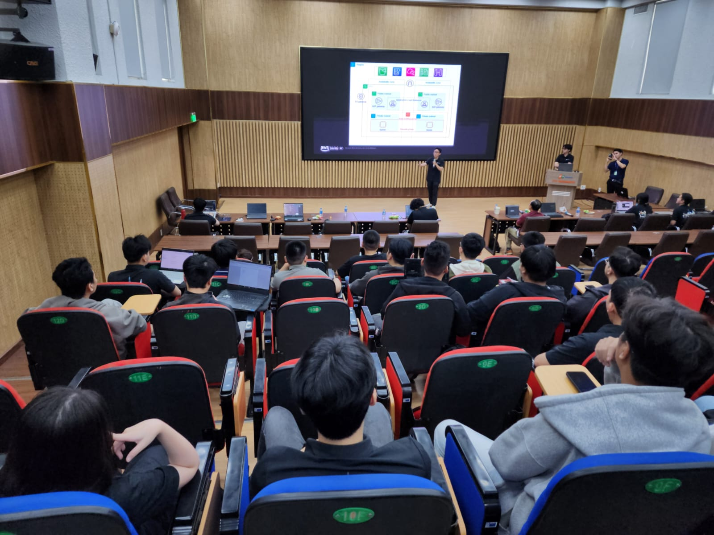
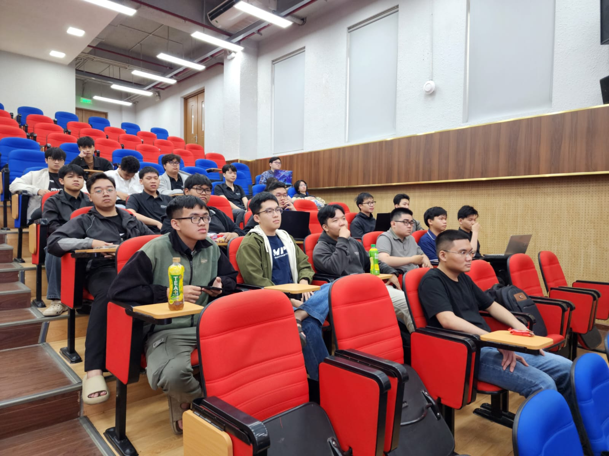

# Bài thu hoạch “Cloud Mastery Series #3: Security & Networking in AWS”

### Thông tin sự kiện

- **Tên sự kiện:** Cloud Mastery Series #3: Security & Networking in AWS  
- **Thời gian:** 09:00 – 12:00, ngày 11 tháng 04 năm 2026  
- **Địa điểm:** FPTU - Hall Academic A  
- **Vai trò:** Người tham dự  

### Mô tả

Sự kiện tập trung vào các giải pháp bảo vệ hạ tầng mạng và quản lý định danh trên nền tảng Amazon Web Services (AWS). Nội dung bao gồm cách thiết lập tường lửa đa lớp, quản lý truy cập an toàn và các kỹ thuật phòng chống tấn công mạng.

### Mục tiêu sự kiện

- Nắm vững các dịch vụ bảo mật mạng cốt lõi: AWS WAF, Shield, và Network Firewall.  
- Hiểu rõ cơ chế hoạt động của VPC, Subnet, NACL và Security Groups.  
- Triển khai quản lý định danh và quyền truy cập (IAM) theo tiêu chuẩn bảo mật cao nhất.

### Diễn giả

- Lâm Tuấn Kiệt: DevOps Engineer (Chuyên đề AWS Security).  
- Lâm An Thịnh & Nguyễn Phan Quốc Việt: (Chuyên đề Networking on AWS).
- Huỳnh Hoàng Long & Đặng Thị Minh Thu: FCAJ Cloud Engineer Ambassadors (Chuyên đề IAM).

### Điểm nổi bật

#### Bảo vệ tầng mạng và ứng dụng (Network & Application Protection)

- AWS WAF: Bảo vệ ứng dụng web khỏi các lỗ hổng phổ biến như SQL Injection và XSS bằng cách lọc lưu lượng HTTP/HTTPS. 
- AWS Shield: Cung cấp khả năng chống tấn công DDoS; phiên bản Standard miễn phí cho mọi khách hàng, trong khi Advanced cung cấp bảo vệ nâng cao và bảo hiểm chi phí.  
- AWS Network Firewall: Tường lửa trạng thái (stateful) giúp kiểm soát lưu lượng ra/vào ở cấp độ VPC.  

#### Networking & VPC Security

- Security Group vs. NACL: 
    - Security Group: Hoạt động ở cấp độ Instance (ENI), có tính trạng thái (Stateful - tự động cho phép luồng phản hồi).  
    - NACL: Hoạt động ở cấp độ Subnet, không có trạng thái (Stateless), yêu cầu cấu hình cả luật Inbound và Outbound. 
- NAT Gateway: Cho phép các tài nguyên trong Private Subnet kết nối Internet (để cập nhật bản vá) nhưng ngăn chặn kết nối ngược lại từ Internet vào.

#### Quản trị định danh (IAM)

- Nguyên tắc đặc quyền tối thiểu (Least Privilege): Chỉ cấp đúng và đủ quyền hạn cần thiết cho người dùng hoặc dịch vụ.  
- Service Control Policies (SCPs): Thiết lập rào chắn quyền hạn tối đa cho tất cả các tài khoản trong một tổ chức (AWS Organizations). 
- Credential Rotation: Khuyến khích sử dụng IAM Identity Center để có thông tin xác thực tạm thời (short-term) thay vì sử dụng Access Keys dài hạn.  

### Kết quả rút ra

- Hiểu cách kết hợp WAF, Shield và Firewall Manager để tạo ra hệ thống phòng thủ đa tầng.
- Phân biệt được cơ chế Stateless của NACL và Stateful của Security Group để tránh lỗi mất kết nối khi cấu hình mạng.
- Biết cách sử dụng IAM Access Analyzer để phát hiện các chính sách đang công khai tài nguyên ngoài ý muốn.

### Ứng dụng vào công việc

- Áp dụng mô hình Zero Trust vào việc thiết kế hạ tầng: luôn kiểm tra và mặc định từ chối mọi kết nối.
- Sử dụng Permission Boundaries để giới hạn quyền cho các tài khoản người dùng, tránh tình trạng leo thang đặc quyền trong dự án.

### Trải nghiệm sự kiện

Sự kiện diễn ra rất sôi nổi với các phần demo thực tế về cách cấu hình luật tường lửa và kiểm tra quyền truy cập. Các diễn giả nhiệt tình giải đáp thắc mắc về các lỗi phổ biến như "Port Exhaustion" trên NAT Gateway

### Bài học rút ra

 Việc cấu hình sai một luật nhỏ trong NACL hay để lộ Access Key dài hạn có thể dẫn đến rủi ro lớn cho toàn bộ hệ thống. Luôn ưu tiên sử dụng MFA và các dịch vụ quản lý tập trung như Firewall Manager. 

### Một số hình ảnh tham gia sự kiện

### Tổng kết

Sự kiện Cloud Mastery Series #3 đã cung cấp một cái nhìn toàn diện và có chiều sâu về hệ thống bảo vệ đa lớp trên môi trường điện toán đám mây AWS. Nội dung không chỉ dừng lại ở lý thuyết mà còn đi sâu vào các cơ chế vận hành thực tế của hạ tầng mạng và quản trị định danh.